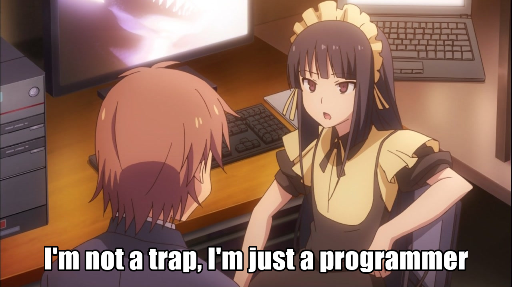
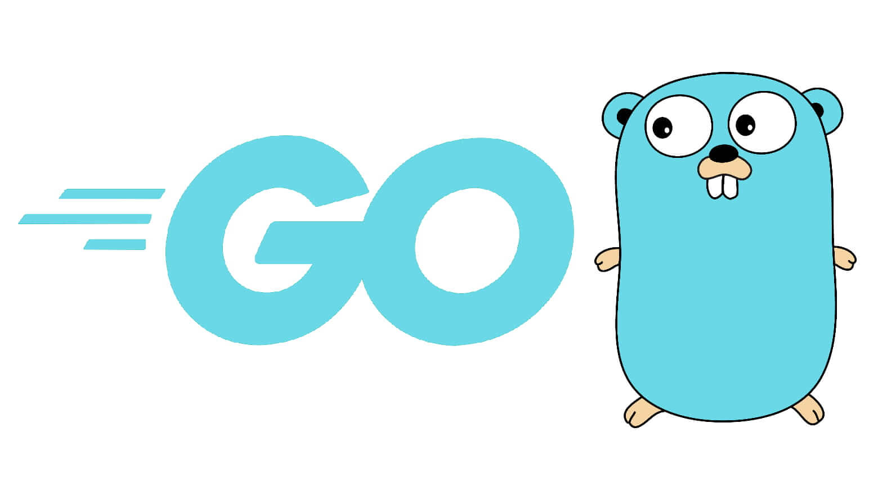
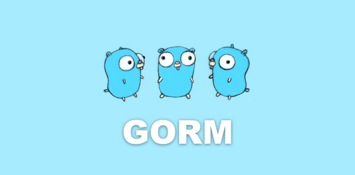
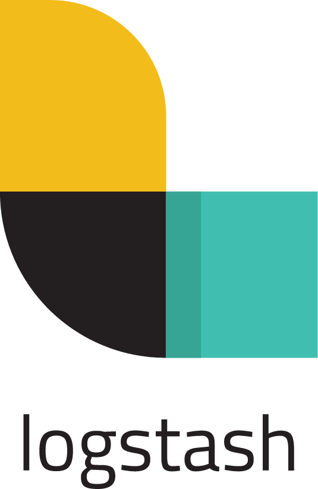
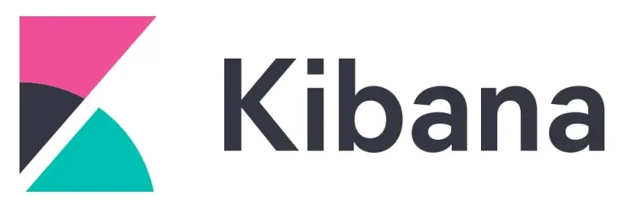
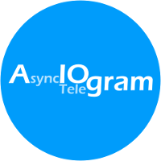
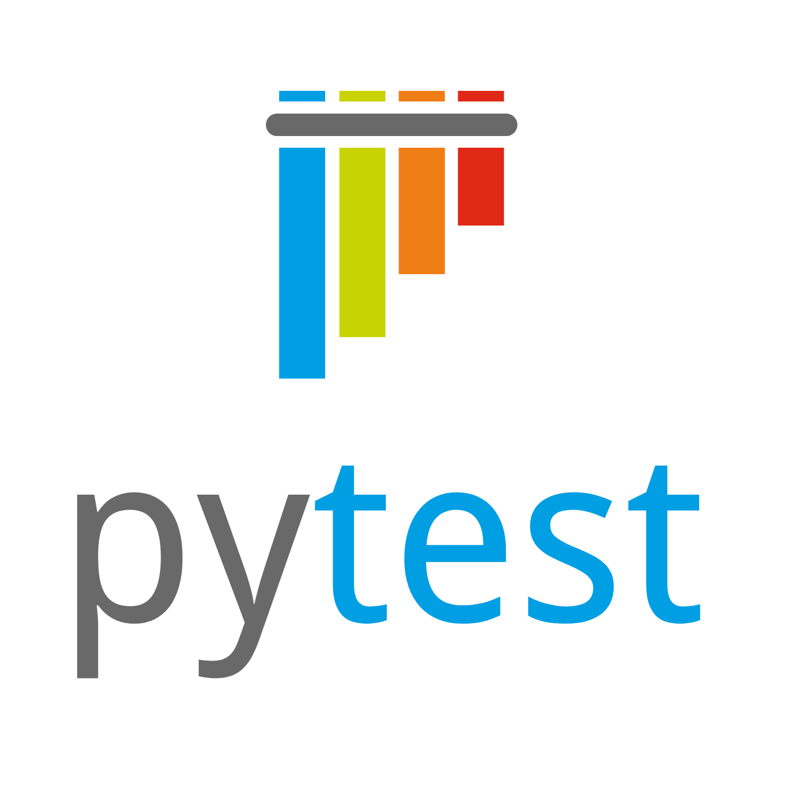

<!-- README.md -->

<h1 align="center">Hi there, I'm daniyarsus!</h1>

  

<h3 align="center">My name is Daniyar, and I'm passionate about building with various technologies. Here's a snapshot of what I work with:</h4>

---

<h2 align="center">Technologies I Use</h2>

<h3 align="center"Progamming languages</h3>

  
  
  

<h3 align="center">Backend</h3>

  
  
  
  
  
  
  
  
  
  
  
  
  
  
  
  

<h3 align="center">ML/DS</h3>

  
  
  
  
  
  

<h3 align="center">Bot</h3>

  

<h3 align="center">Mobile</h3>

  

<h3 align="center">Test</h3>

  

<h3 align="center">OS/Distributives</h3>

  
  

<h3 align="center">Containers, deploy etc.</h3>

  
  

---

<h3 align="center">About Me</h3>

  I'm 19 years old and enthusiastic about software development, especially in Python and Dart. Reach out if you share similar interests or need any help with these technologies!

