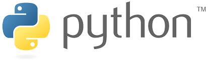
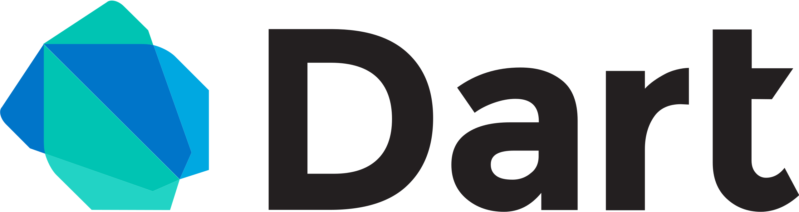

<!-- README.md -->

<h1 align="center">Hi there, I'm daniyarsus!</h1>

  

<h3 align="center">My name is Daniyar, and I'm passionate about building with various technologies. Here's a snapshot of what I work with:</h4>

---

<h3 align="center">My stack</h3>

  
  
  

<h4 align="center">Other technologies I use<h4>
* PostgreSQL, Redis, Scylla, OpenSearch, Qdrant, Clickhouse, MinIO
* REST, gRPC
* NATS, Kafka
* Docker (and compose), k3s
* Linux (exact Ubuntu)
* CI/CD, AWS, Google Cloud, Azure
* pytest, testify
* FastAPI, LiteStar, Aiogram, Flutter, SQLAlchemy, GORM
* Pytorch, Tensorflow, ONNX
* DDD, Clean, Hexagonal

---

<h3 align="center">About Me</h3>

  I'm 20 years old and enthusiastic about software development, especially in Python, Go and Dart. Reach out if you share similar interests or need any help with these technologies!

